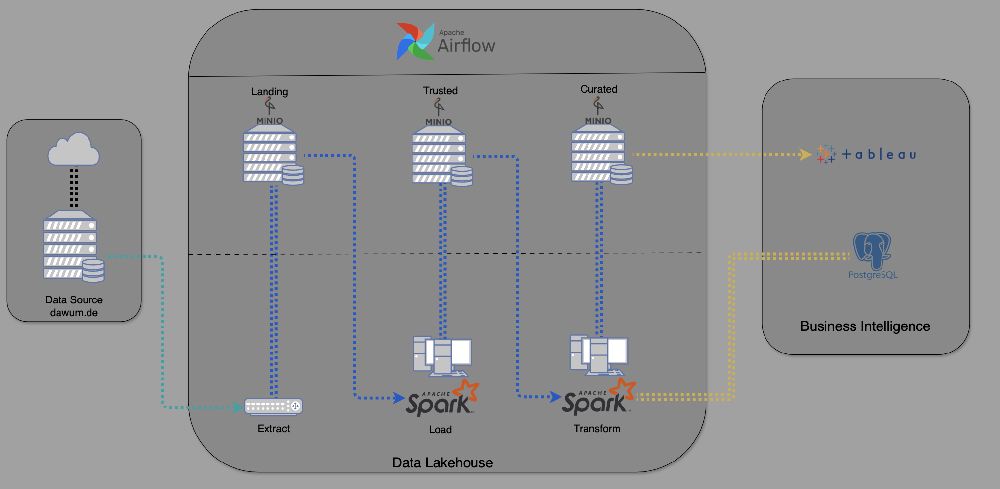
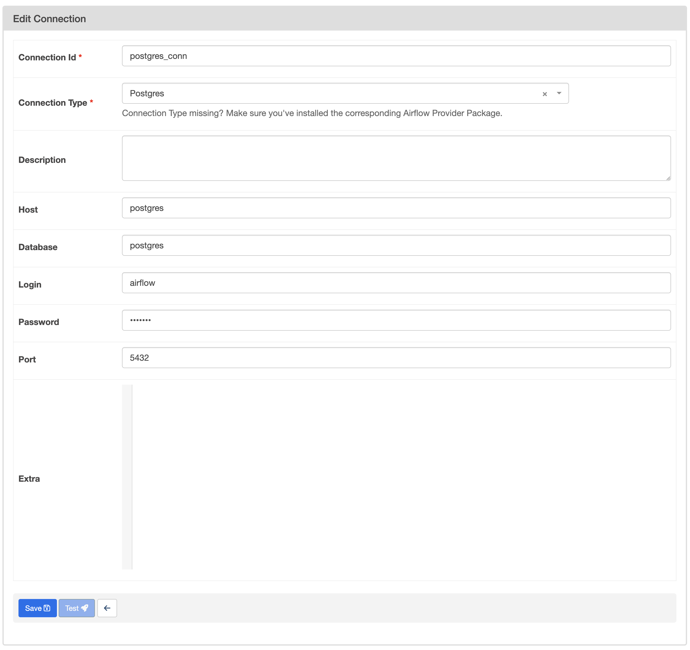
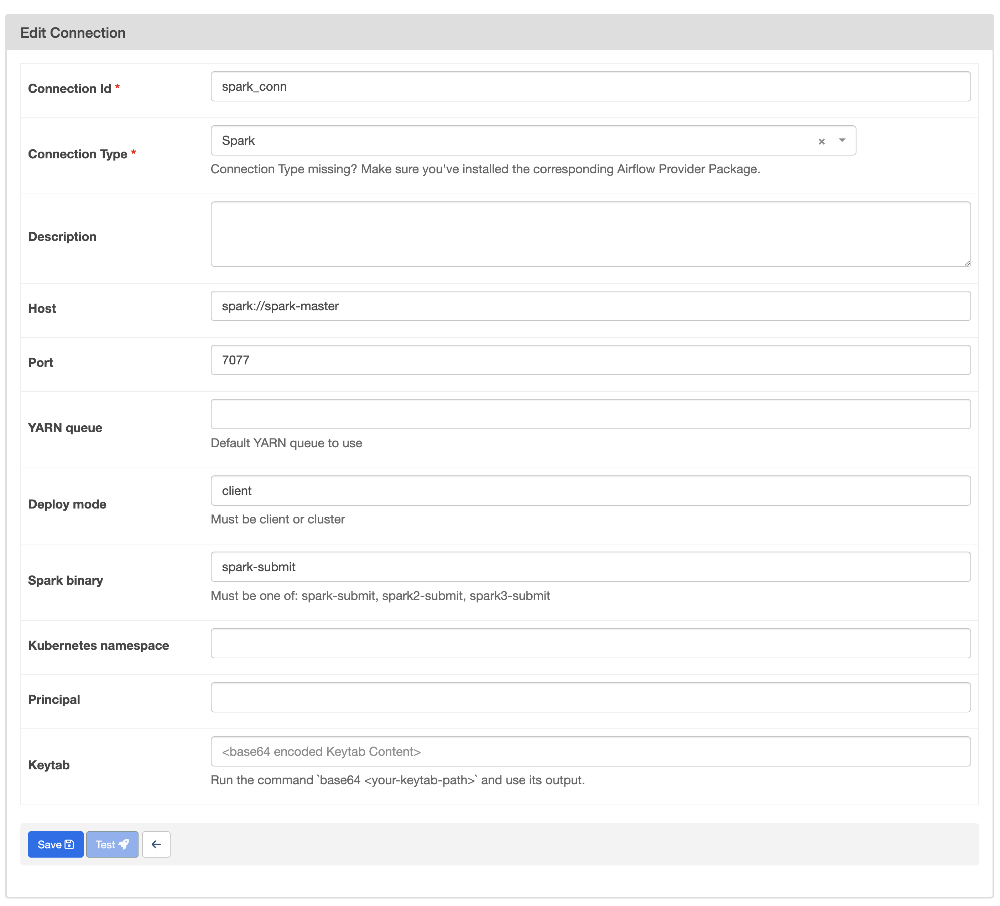

# German Election 2025 Data Pipeline

## Project Overview

The **German Election 2025 Data Pipeline** project is designed to collect, process, and analyze survey data related to the 2025 German federal elections. Utilizing a combination of Docker, Apache Spark, Apache Airflow, and PostgreSQL, this project establishes an efficient Extract, Transform, Load (ETL) pipeline. The architecture ensures seamless data ingestion, transformation, and storage, facilitating comprehensive analysis and visualization of election survey results. For more details about the architecture, please visit: [https://nbkhuong.github.io/german-election-2025/](). 



## Prerequisites

Before setting up the project, ensure you have the following installed:

* Docker

## Project Setup and Docker Deployment

Follow these steps to set up and run the project using Docker:

* **Clone the Repository:**

  ```
  git clone https://github.com/nbkhuong/german-election-2025.git
  cd german-election-2025
  ```
* **Build the Custom Airflow Image:**
  The project includes a `Dockerfile` to create a custom Airflow image with the necessary dependencies.

  ```
  docker build . --tag my_custom_airflow:latest
  ```
* **Initialize Airflow:**
  Before launching the services, initialize the Airflow database and create the necessary configurations.

  ```
  docker-compose up airflow-init
  ```
* **Launch the Services:**
  Start all services defined in the `docker-compose.yaml` file, including Airflow, PostgreSQL, and any other dependencies.

  ```
  docker-compose up -d
  ```

  The `-d` flag runs the services in detached mode.
* **Access the Airflow, MinIO, Spark Web Interface:**
  Once the services are running, access the Airflow web interface to monitor and manage your workflows by:

  * URL: `http://0.0.0.0:8080</`
  * Default Credentials:
    * Username: `airflow`
    * Password: `airflow`

  To access MinIO:

  * URL: `http://0.0.0.0:9091`
  * Default Credentials:
    * Username: `minioadmin`
    * Password: `minioadmin`

  To access Spark cluster:

  * URL: `http://0.0.0.0:9090`
* **Shut Down the Services:**
  When you're finished, you can stop and remove all running containers and associated volumes with:

  ```
  docker-compose down -v
  ```

## Configuring PostgreSQL to connect to Airflow

PostgreSQL serves as the project's relational database. Configuration steps include:

1. **Database Initialization:**
   Make sure the `docker-compose.yaml` file sets up the PostgreSQL service with environment variables for the database name, user, and password.
2. **Connection Setup:**
   After logging in to Airflow, in menu bar on the top of the page, go to Admin->Connection. Add a new Rercord for Postgres as follow:
   Click Save and the Postgres should be connnected to Airflow by now.
3. **Accessing PostgreSQL:**
   In this project, DBeaver is selected as database administration tool.

## Configuring Apache Spark to connect with Airflow

DBeaver is a database management tool that can be used to interact with the PostgreSQL database. To set it up:

1. **Spark Cluster Initialization:**
   Make sure the `docker-compose.yaml` file sets up the Spark services with environment variables for the database name, user, and password.
2. **Connection Setup:**
   After logging in to Airflow, in menu bar on the top of the page, go to Admin->Connection. Add a new Rercord for Spark as follow:

   
   Click Save and Spark should be now connected to Airflow.

## Configuring MinIO to connect with Airflow

In this project, MinIO read/write operations are perform over boto3. This being said, access credentials from MinIO must be provided to boto3 in .env files.

To find the credentials, follow these steps:

1. Login to MinIO with the default access credentials above.
2. Click "Acess Key" on the sidebar, and select "Create access key".
3. Enter the name and copy the "Access Key" and "Secret Key" to the .env file.

## Acknowledgements

Wahlumfragen: https://dawum.de/
