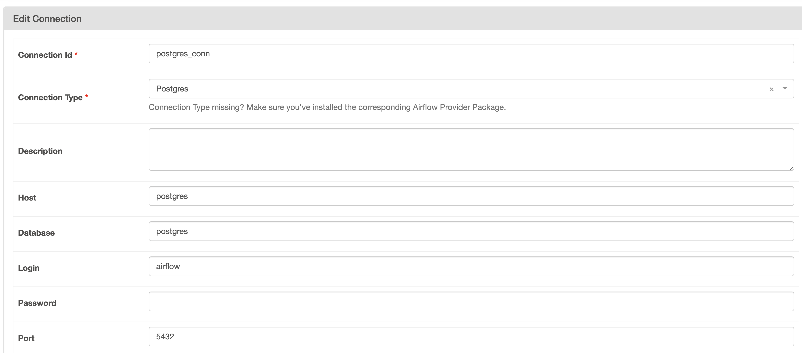
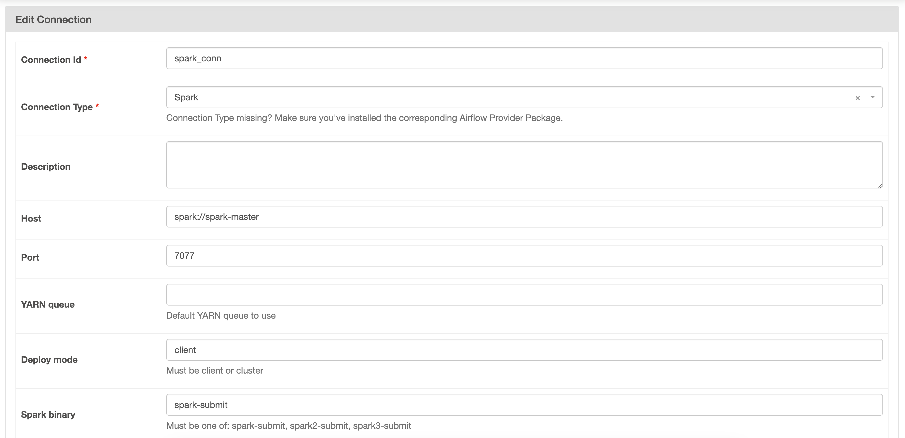

# german_election_2025

German election surveys - 2025

docker-compose up airflow-init

docker compose up -d

docker compose down -v

docker build . --tag my_custom_airflow:latest

{"aws_access_key_id": "gJr1cEsppCZMxxI3FrD7", "aws_secret_access": "JdRNzqBz2UlWRgRUVFgAPZEM8VqOvIwNiuRbTmM6", "endpoint_url": "http://localhost:9091/"}

multistage docker image build

https://www.worldclub-tennis.com/

https://www.facebook.com/groups/347332853669645/user/100000342692403/

https://heimwegtelefon.net/fair-use/
